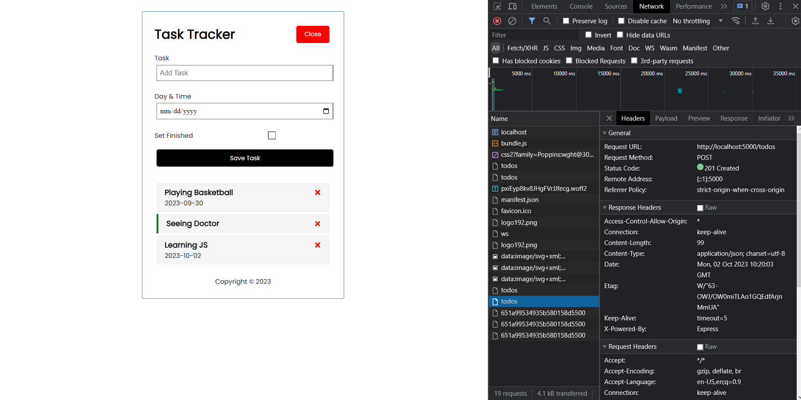

# React Task Tracker

This is a Full Stack Project created by React JS and Node JS (Mongodb).

## Description
This project aim is to track your task, by adding tasks, deleteing them and updated each task to finished or not.
All this CRUD operations is related of a bulit in api to handle it. 
## Usage 
- you can clone this repo in your device then run a npm i command to install all needed tools. Then run a npm start command 
- you can add task by click on Add button and fill the text and day the click on Add Task button.
- you can delete task by one click on 'X' button.
- you can set a task as finished by double click on task.

